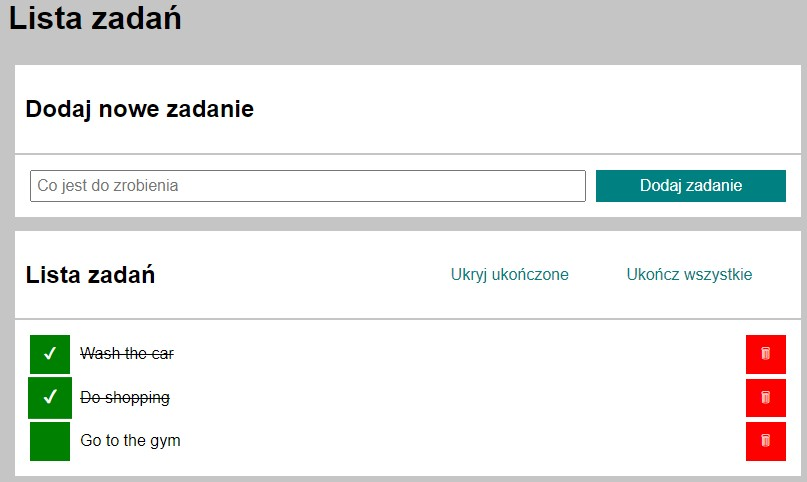

# Tasks app
### Website address: [Adres](https://t-samborski.github.io/todo-list-react/)
## The application consists in creating a list of tasks to be done by the user.

## In the input field, the user can enter what task he has to perform. Then, after clicking on the *Dodaj zadanie* button, a list of tasks will be created.

## The user can enter any number of sentences that will appear in the application field in the form of a list.

## The task list has several options to make it easier for the user to use it. Among other things, it is possible to mark tasks already completed using the green button on the left. Thanks to this, the task is automatically deleted and the mark symbol appears on the green button.

## Thanks to the *Ukończ wszystkie* button, it is possible to mark all tasks as completed at once. This button then becomes inactive and changes its color so that the user knows that there is no task that is not completed.

### In addition, there is an option to hide completed tasks so that they are not visible in the task list. Of course, you can view them back at any time.

## The last element of the application that the user can use is deleting tasks. Both those marked as completed and those not yet completed.

# Technologies used in the application.
- HTML
- CSS
- Java Script
- Normalize CSS
- BEM convention
- React.js

#### The application is created by styled-components. All sections of the website are in a separate directory, and the functions are in one hook. This makes the App.js file as transparent as possible.

### The useState hook allows you to save the changes made to the application, so that the user will not lose the changes even after closing the application or refreshing the page.
